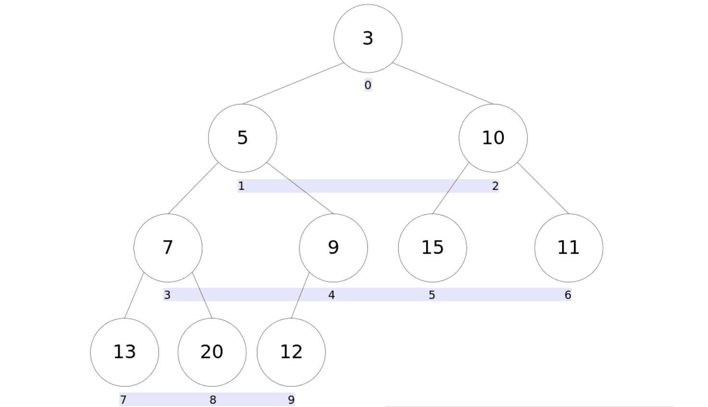
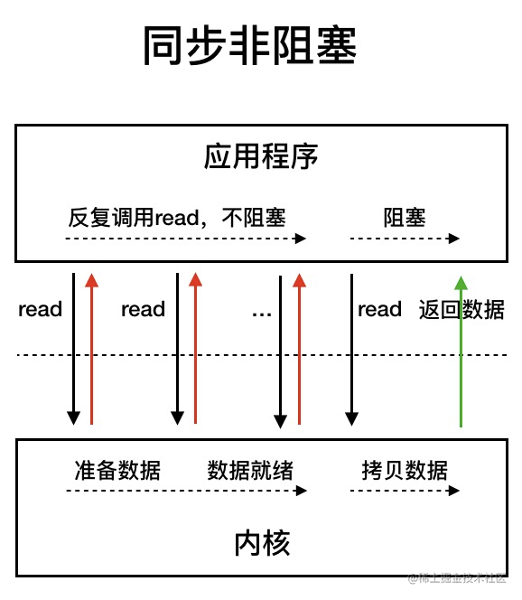

## start

> 笔记摘抄(精简)自[JavaGuide](https://javaguide.cn/)，全文很多地方都是从JavaGuide摘抄过来的，只为了简化重点，突出重点，并加入自己的理解，只做学习使用
> 需要完整阅读请前往 JavaGuide 阅读

[TOC]

## 字符串String

### 字符和字符串的编码

- char占2个字节
- String中一个字符占1一个字节

JDK8及以前，String中用char数组存储字符串

JDK9开始，String使用byte数组存储字符串，若存储的字符编码范围不超过**Latin-1**，则每个byte只占1个字节，若超过Latin-1，则使用**UTF-16**编码，byte和char所占据字节数一样

### String为什么是不可变的

String内部使用 `private final char value[]` 存储数据
String类本身被 `final` 修饰

1. final修饰引用类型的变量表示**不能再指向其他对象**
2. private修饰，且String没有提供访问char数组的方法，所以**无法修改char数组本身**
3. String 类被 final 修饰导致其**不能被继承**，进而**避免了子类破坏 String 不可变**

### 字符串拼接可以使用“+”吗？

1. JDK8及以前，使用StringBuilder或者StringBuffer进行拼接，使用 + 拼接会创建多个StringBuilder对象
2. JDK9以后，使用 + 进行拼接时，会使用到InvokeDynamic动态方法**makeConcatWithConstants**，中英文混杂时速度以及使用的内存甚至会优于使用StringBuilder

> 在开启字符串压缩的情况下，`StringBuilder` 拼接无法压缩的（如中文）字符串会引来一次额外的内存分配。（至少 Java 19 在 `builder.setLength(0)` 后还会这样。）
>
> 有对应的工具方法的操作，如 `String::join`，那还是用对应的方法好一点。

## 包装类型的缓存机制

- `Byte`,`Short`,`Integer`,`Long` 这 4 种包装类默认创建了数值 **[-128，127]** 的相应类型的缓存数据，
- `Character` 创建了数值在 **[0,127]** 范围的缓存数据，
- `Boolean` 直接返回 **True** or **False**。

> Float 和 Double 浮点数没有实现缓存机制。

## HashCode

**为什么要有hashCode？**
因为hashCode比equals快，能加快判断两个对象的值是否相等

**为什么重写 equals() 时必须重写 hashCode() 方法？**
因为两个相等的对象的 `hashCode` 值必须是相等。如果重写 `equals()` 时没有重写 `hashCode()` 方法的话就可能会导致 `equals` 方法判断是相等的两个对象，`hashCode` 值却不相等。

**哈希碰撞的处理方法：**
链接法、红黑树
开放寻址：线性探测（懒删除机制）、平方探测、多次哈希

## Java语法糖

**语法糖（Syntactic sugar）** 代指的是编程语言为了方便程序员开发程序而设计的一种特殊语法，这种语法对编程语言的功能并没有影响。实现相同的功能，基于语法糖写出来的代码往往**更简单简洁且更易阅读**。

> 不过，JVM 其实并不能识别语法糖，Java 语法糖要想被正确执行，需要先通过编译器进行解糖，也就是在程序编译阶段将其转换成 JVM 认识的基本语法。这也侧面说明，Java 中真正支持语法糖的是 **Java 编译器而不是 JVM**。
>
> Java 中最**常用的语法糖**主要有：
>
> 1. Switch开始支持String类型	
>    - 转换为hashcode + equals判断，本质上还是判断int
> 2. 泛型
>    - 所有泛型都会在编译时进行 类型擦除
> 3. 自动装箱与拆箱
>    - 调用Integer.valueoOf()进行装箱，调用Integer.intValue()进行拆箱
> 4. 可变长参数
>    - 将可变长参数转换为一个参数数组
> 5. 枚举
>    - 生成一个final的类并继承Enum类
> 6. 内部类
>    - 编译时会生成两个.class文件
> 7. 条件编译
>    - 判断条件为常量时，编译时会自动去除常量为false的语句
> 8. 断言
>    - assert会被编译为普通的if-else语句，true就继续执行，false就抛出AssertError打断程序执行
> 9. 数值字面量
>    - 编译后删除数值中方便阅读的 '_'
> 10. 增强for循环for-each
>     - 转换为普通for循环 或者 迭代器
> 11. try-with-resources
>     - 帮我们关闭资源，不用再在finally中手动关闭
> 12. lambda表达式
>     - 编译时将lambda表达式转换成调用内部 api 的方式
> 13. ...
>
> 具体讲解与字节码分析看 https://javaguide.cn/java/basis/syntactic-sugar.html#java-%E4%B8%AD%E6%9C%89%E5%93%AA%E4%BA%9B%E5%B8%B8%E8%A7%81%E7%9A%84%E8%AF%AD%E6%B3%95%E7%B3%96

## Java序列化

- **序列化**：将数据结构或对象转换成二进制字节流的过程
- **反序列化**：将在序列化过程中所生成的二进制字节流转换成数据结构或者对象的过程

序列化和反序列化常见应用场景：

- 对象在进行**网络传输**（比如远程方法调用 RPC 的时候）之前需要先被序列化，接收到序列化的对象之后需要再进行反序列化；
- 将对象存储到**文件**之前需要进行序列化，将对象从文件中读取出来需要进行反序列化；
- 将对象存储到**数据库**（如 Redis）之前需要用到序列化，将对象从缓存数据库中读取出来需要反序列化；
- 将对象存储到**内存**之前需要进行序列化，从内存中读取出来之后需要进行反序列化。

### 序列化协议对应于 TCP/IP 4 层模型的哪一层？

1. 应用层
2. 传输层
3. 网络层
4. 网络接口层


> 图片出自JavaGuide

**序列化和反序列化**对应其中的表示层

### 常见的序列化协议

JDK 自带的序列化方式一般不会用 ，因为序列化效率低并且存在安全问题。比较常用的序列化协议有 Hessian、Kryo、Protobuf、ProtoStuff，这些都是基于二进制的序列化协议。

像 JSON 和 XML 这种属于文本类序列化方式。虽然可读性比较好，但是性能较差，一般不会选择。

### serialVersionUID 有什么作用？

序列化号 `serialVersionUID` 属于版本控制的作用。反序列化时，会检查 `serialVersionUID` 是否和当前类的 `serialVersionUID` 一致。如果 `serialVersionUID` 不一致则会抛出 `InvalidClassException` 异常。强烈推荐每个序列化类都手动指定其 `serialVersionUID`，如果不手动指定，那么编译器会动态生成默认的 `serialVersionUID`。

> **serialVersionUID 不是被 static 变量修饰了吗？为什么还会被“序列化”？**
>
> `static` 修饰的变量是静态变量，位于方法区，本身是不会被序列化的。`serialVersionUID` 只是用来被 JVM 识别，实际并没有被序列化。

### 如果有些字段不想进行序列化怎么办？

使用 `transient` 关键字修饰。

`transient` 关键字的作用是：阻止实例中那些用此关键字修饰的的变量序列化；当对象被反序列化时，被 transient 修饰的变量值不会被持久化和恢复。

> 关于 `transient` 还有几点注意：
>
> - `transient` 只能修饰变量，不能修饰类和方法。
> - `transient` 修饰的变量，在反序列化后变量值将会被置成类型的**默认值**。例如，如果是修饰 `int` 类型，那么反序列后结果就是 `0`。
> - `static` 变量因为不属于任何对象(Object)，所以无论有没有 `transient` 关键字修饰，**均不会被序列化。**

### 为什么不推荐使用JDK自带的序列化？

**不支持跨语言调用**：如果调用的是其他语言开发的服务的时候就不支持了。

**性能差**：相比于其他序列化框架性能更低，主要原因是序列化之后的字节数组体积较大，导致传输成本加大。

**存在安全问题**：序列化和反序列化本身并不存在问题。但当输入的反序列化的数据可被用户控制，那么攻击者即可通过构造恶意输入，让反序列化产生非预期的对象，在此过程中执行构造的任意代码。

## Java值传递

Java 中将实参传递给方法（或函数）的方式是 **值传递**：

- 如果参数是基本类型的话，很简单，传递的就是基本类型的字面量值的拷贝，会创建副本。
- 如果参数是引用类型，传递的就是实参所引用的对象在堆中地址值的拷贝，同样也会创建副本


方法的定义可能会用到 **参数**（有参的方法），参数在程序语言中分为：

- **实参（实际参数，Arguments）**：用于传递给函数/方法的参数，必须有确定的值。
- **形参（形式参数，Parameters）**：用于定义函数/方法，接收实参，不需要有确定的值。

```java
String hello = "Hello!";
// hello 为实参
sayHello(hello);
// str 为形参
void sayHello(String str) {
    System.out.println(str);
}
```


程序设计语言将实参传递给方法（或函数）的方式分为两种：

- **值传递**：方法接收的是实参值的拷贝，会创建副本。
- **引用传递**：方法接收的直接是实参所引用的对象在堆中的地址，不会创建副本，对形参的修改将影响到实参。

很多程序设计语言（比如 C++、 Pascal )提供了两种参数传递的方式，不过，**在 Java 中只有值传递。**

> 为什么Java只有值传递？	/	举一个Java不是引用传递的例子
>
> ```java
> public class Person {
>     private String name;
>    // 省略构造函数、Getter&Setter方法
> }
> 
> public static void main(String[] args) {
>     Person xiaoZhang = new Person("小张");
>     Person xiaoLi = new Person("小李");
>     swap(xiaoZhang, xiaoLi);
>     System.out.println("xiaoZhang:" + xiaoZhang.getName());
>     System.out.println("xiaoLi:" + xiaoLi.getName());
> }
> 
> public static void swap(Person person1, Person person2) {
>     Person temp = person1;
>     person1 = person2;
>     person2 = temp;
>     System.out.println("person1:" + person1.getName());
>     System.out.println("person2:" + person2.getName());
> }
> ```
>
> 输出:
>
> ```plain
> person1:小李
> person2:小张
> xiaoZhang:小张
> xiaoLi:小李
> ```
>
> 并没有影响到实参本身的值

## Java泛型&通配符

> 参考：https://www.cnblogs.com/XiiX/p/14719568.html

### 为什么要使用泛型？

1. 在编译时会有**更强的类型检查**
2. **消除类型转换**
3. 可以实现**更通用的算法**

```java
class name<T1, T2, ..., Tn> {}

public interface Content<T> {
    T text();
}

public <T> T func(T obj) {}
//是否拥有泛型方法，与其所在的类是否是泛型没有关系。
```

### 泛型的实现

Java 泛型是使用**类型擦除（Type Erasure）**来实现的，使用泛型时，任何具体的类型信息都被擦除了。

类型擦除做了什么呢？它做了以下工作：

- 把泛型中的所有类型参数**替换为 Object**，如果指定类型边界，则使用类型边界来替换。因此，生成的字节码仅包含普通的类，接口和方法。
- 擦除出现的类型声明，即去掉 `<>` 的内容。比如 `T get()` 方法声明就变成了 `Object get()` ；`List<String>` 就变成了 `List`。如有必要，编译器**自动插入类型转换**以保持类型安全。
- 生成桥接方法以保留扩展泛型类型中的多态性。类型擦除确保不为参数化类型创建新类；因此，泛型不会产生运行时开销。

> 简单来说类型擦除是指，**虚拟机对泛型其实一无所知，所有的工作都是编译器做的。**(泛型是语法糖，语法糖是需要编译器进行解糖成为JVM认识的基本语法)
>
> 即《为什么要使用泛型中》的：更强的编译器类型检查，和自动类型转换，无需我们手动类型转换

```java
//例如，我们编写了一个泛型类Pair<T>，这是编译器看到的代码：
public class Pair<T> {
    private T first;
    private T last;
    private List<Integer> list;
}
main() {
    Pair<String> p = new Pair<>("Hello", "world");
    String first = p.getFirst();
    String last = p.getLast();
}


//而虚拟机根本不知道泛型。这是虚拟机执行的代码：
public class Pair {
    private Object first;
    private Object last;
    private List list;	//List的不指定泛型是List<Object>
}
//帮助我们进行自动类型转换：
main() {
    Pair p = new Pair("Hello", "world");
    String first = (String) p.getFirst();
    String last = (String) p.getLast();
}
```

因此，Java使用类型擦拭实现泛型，导致了：

- 编译器把类型`<T>`视为`Object`；
- 编译器根据`<T>`自动实现安全的强制转型。

### 泛型的局限性

了解了Java泛型的实现方式————类型擦除，我们就知道了Java泛型的局限：

1. `<T>`不能是基本类型，例如`int`，因为实际类型是`Object`，`Object`类型无法持有基本类型：

   ```java
   Pair<int> p = new Pair<>(1, 2); // compile error!
   ```

2. 泛型没有自己的`Class`对象。观察以下代码：

   ```java
   public static void main(String[] args) {
       List<Object> list1 = new ArrayList<Object>();
       List<String> list2 = new ArrayList<String>();
       System.out.println(list1.getClass());	// class java.util.ArrayList
       System.out.println(list2.getClass());	// class java.util.ArrayList
   }
   //List<T>的class都是List，不管T是什么
   ```

3. 无法判断带泛型的类型：

   ```java
   List<Integer> p = new ArrayList<>();
   // Compile error:
   if (p instanceof List<String>) {
   }
   //原因和前面一样，不存在List<String>.class，而是只有唯一的List.class。
   ```

4. 泛型类型无法向上转型

   > Integer 继承了 Object；ArrayList 继承了 List；但是 List<Interger> 却并非继承了 List<Object>。
   >
   > 原因：也是和前面一样，泛型类并没有自己独有的 Class 类对象。比如：并不存在 List<Object>.class 或是 List<Interger>.class，Java 编译器会将二者都视为 List.class。

### 上下边界（通配符）

```java
/*上边界*/
// 适用于方法：限制传入方法的参数的类型
<? extends xxx>
// 适用于类：限制T的类型
<T extends XXX>
// 类型边界可以设置多个，语法形式如下：
<T extends B1 & B2 & B3>

/*下边界*/
<? super xxx>
<T super XXX>

/*无限定通配符*/
void sample(Pair<?> p) {
}
```

1. 使用类似`<? extends XXX>`通配符作为方法参数时表示：
   - 允许调用`get()`方法获得`XXX及其子类`的引用。
   - 不允许调用`set(? extends XXX及其子类)`方法传入`XXX及其子类`的引用；
2. 使用`<? super XXX>`通配符表示：
   - 允许调用`set(? super XXX及其子类)`方法传入`XXX及其子类`的引用；
   - 不允许调用`get()`方法获得`XXX及其子类`的引用。
3. 因为`<?>`通配符既没有`extends`，也没有`super`，因此：
   - 不允许调用`set(T)`方法并传入引用（`null`除外）；
   - 不允许调用`T get()`方法并获取`T`引用（只能获取`Object`引用）。

> 具体解释看https://www.cnblogs.com/XiiX/p/14719568.html 目录《4.2 上边界》及以后部分

## Java反射

反射赋予了我们在**运行时分析类**以及执行类中方法的能力。通过反射你可以获取任意一个类的所有属性和方法，你还可以调用这些方法和属性。

### 反射的应用场景

- 框架
- JDK动态代理
- 注解

### 反射的优缺点

**优点**：可以让咱们的代码更加灵活、为各种框架提供开箱即用的功能提供了便利

**缺点**：让我们在运行时有了分析操作类的能力，这同样也增加了**安全问题**。比如可以无视泛型参数的安全检查（泛型参数的安全检查发生在编译时）。另外，反射的**性能也要稍差**点，不过，对于框架来说实际是影响不大的。

### 获取Class对象的四种方式

1. TargetObject.class;
2. Class.forName()
3. instance.getClass()
4. xxxClassLoader.loadClass()

### 反射使用示例

```java
public class TargetObject {
    private String value;

    public TargetObject() {
        value = "spongehah";
    }

    public void publicMethod(String s) {
        System.out.println("I love " + s);
    }

    private void privateMethod() {
        System.out.println("value is " + value);
    }
}

public class Main {
    public static void main(String[] args) throws ClassNotFoundException, NoSuchMethodException, IllegalAccessException, InstantiationException, InvocationTargetException, NoSuchFieldException {
        Class<?> targetClass = Class.forName("TargetObject");
        TargetObject targetObject = (TargetObject) targetClass.newInstance();

        Method publicMethod = targetClass.getDeclaredMethod("publicMethod", String.class);
        publicMethod.invoke(targetObject, "兮兮哈哈");

        Field value = targetClass.getDeclaredField("value");
        value.setAccessible(true);	//private修饰的变量：取消安全检查
        value.set(targetObject, "xixihaha");

        Method privateMethod = targetClass.getDeclaredMethod("privateMethod");
        privateMethod.setAccessible(true);
        privateMethod.invoke(targetObject);
    }
}
```

## Java代理模式

1. 静态代理
2. 动态代理
   - JDK动态代理（有接口时）
   - CGLIB 动态代理（无接口时，使用ASM框架操作字节码，生成一个被代理类的子类）

> 代理模式详细实现请看我的博客 [Java23 种设计模式](https://blog.hahhome.top/blog/Java%E8%AE%BE%E8%AE%A1%E6%A8%A1%E5%BC%8F/#5-1-%E4%BB%A3%E7%90%86%E6%A8%A1%E5%BC%8F%E2%98%85)

## Java高精度浮点数BigDecimal

### BigDecimal介绍和作用

为了避免精度丢失，可以使用 `BigDecimal` 来进行浮点数的运算

示例代码：

```java
float a = 2.0f - 1.9f;
float b = 1.8f - 1.7f;
System.out.println(a);// 0.100000024
System.out.println(b);// 0.099999905
System.out.println(a == b);// false
```

**为什么浮点数 `float` 或 `double` 运算的时候会有精度丢失的风险呢？**

这个和计算机保存浮点数的机制有很大关系。我们知道计算机是二进制的，而且计算机在表示一个数字时，宽度是有限的，无限循环的小数存储在计算机时，只能被截断，所以就会导致小数精度发生损失的情况。这也就是解释了为什么浮点数没有办法用二进制精确表示。

> 就比如说十进制下的 0.2 就没办法精确转换成二进制小数：
>
> ```java
> // 0.2 转换为二进制数的过程为，不断乘以 2，直到不存在小数为止，
> // 在这个计算过程中，得到的整数部分从上到下排列就是二进制的结果。
> 0.2 * 2 = 0.4 -> 0
> 0.4 * 2 = 0.8 -> 0
> 0.8 * 2 = 1.6 -> 1
> 0.6 * 2 = 1.2 -> 1
> 0.2 * 2 = 0.4 -> 0（发生循环）
> ...
> ```

《阿里巴巴 Java 开发手册》中提到：**浮点数之间的等值判断，基本数据类型不能用 == 来比较，包装数据类型不能用 equals 来判断。**


### BigDecimal的创建

1. new BigDecimal(String val)
2. BigDecimal.valueOf(double val)

> 《阿里巴巴 Java 开发手册》禁止使用 new BigDecimal(double val) 的方式创建BigDecimal，因为也会存在精度损失，例如：new BigDecimal(0.1F)，实际存储的是0.10000000149

### BigDecimal的运算

```java
BigDecimal a = new BigDecimal("1.0");
BigDecimal b = new BigDecimal("0.9");
System.out.println(a.add(b));// 1.9
System.out.println(a.subtract(b));// 0.1
System.out.println(a.multiply(b));// 0.90
System.out.println(a.divide(b));// 无法除尽，抛出 ArithmeticException 异常
System.out.println(a.divide(b, 2, RoundingMode.HALF_UP));// 1.11
```

```java
public BigDecimal divide(BigDecimal divisor, int scale, RoundingMode roundingMode) {
    return divide(divisor, scale, roundingMode.oldMode);
}
//`scale` 表示要保留几位小数，`roundingMode` 代表保留规则。
建议对保留规则设置为 RoundingMode.HALF_EVEN,即四舍六入五成双 （五成双：前一位是奇数则入，偶数则舍）

// 2.5 -> 3 , 1.6 -> 2
// -1.6 -> -2 , -2.5 -> -3
UP(BigDecimal.ROUND_UP),
// 2.5 -> 2 , 1.6 -> 1
// -1.6 -> -1 , -2.5 -> -2
DOWN(BigDecimal.ROUND_DOWN),
// 2.5 -> 3 , 1.6 -> 2
// -1.6 -> -1 , -2.5 -> -2
CEILING(BigDecimal.ROUND_CEILING),
// 2.5 -> 2 , 1.6 -> 1
// -1.6 -> -2 , -2.5 -> -3
FLOOR(BigDecimal.ROUND_FLOOR),
// 2.5 -> 3 , 1.6 -> 2
//-1.6 -> -2 , -2.5 -> -3
HALF_UP(BigDecimal.ROUND_HALF_UP)
//......
```

### BigDecimal等值比较

使用 `compareTo()` 方法，不能使用 equals() 方法，因为 equals() 方法不仅仅会比较值的大小（value）还会比较精度（scale），而 compareTo() 方法比较的时候会忽略精度。

## Java 魔法类 Unsafe

`Unsafe` 是位于 `sun.misc` 包下的一个类，主要提供一些用于执行**低级别**、**不安全**操作的方法，如直接访问系统内存资源、自主管理内存资源等，这些方法在提升 Java 运行效率、增强 Java 语言底层资源操作能力方面起到了很大的作用。

但由于 `Unsafe` 类使 Java 语言拥有了类似 C 语言指针一样操作内存空间的能力，这无疑也增加了程序发生相关指针问题的风险。在程序中过度、不正确使用 `Unsafe` 类会使得程序出错的概率变大，使得 Java 这种安全的语言变得不再“安全”，因此对 `Unsafe` 的使用一定要慎重。

另外，`Unsafe` 提供的这些功能的实现需要依赖本地方法（Native Method），对于同一本地方法，不同的操作系统可能会通过不同的方式来实现

**为什么要使用本地方法呢？**

1. 与Java环境外交互
2. 与操作系统交互

### Unsafe 创建

`sun.misc.Unsafe` 部分源码如下：

```java
public final class Unsafe {
  // 单例对象
  private static final Unsafe theUnsafe;
  ......
  private Unsafe() {
  }
  @CallerSensitive
  public static Unsafe getUnsafe() {
    Class var0 = Reflection.getCallerClass();
    // 仅在引导类加载器`BootstrapClassLoader`加载时才合法
    if(!VM.isSystemDomainLoader(var0.getClassLoader())) {
      throw new SecurityException("Unsafe");
    } else {
      return theUnsafe;
    }
  }
}
```

`Unsafe` 类为一单例实现，提供静态方法 `getUnsafe` 获取 `Unsafe`实例。这个看上去貌似可以用来获取 `Unsafe` 实例。但是，当我们直接调用这个静态方法的时候，会抛出 `SecurityException` 异常

**为什么 `public static` 方法无法被直接调用呢？**

这是因为在`getUnsafe`方法中，会对调用者的`classLoader`进行检查，判断当前类是否由`Bootstrap classLoader`加载，如果不是的话那么就会抛出一个`SecurityException`异常。也就是说，只有启动类加载器加载的类才能够调用 Unsafe 类中的方法，来防止这些方法在不可信的代码中被调用。

**为什么要对 Unsafe 类进行这么谨慎的使用限制呢?**

`Unsafe` 提供的功能过于底层（如直接访问系统内存资源、自主管理内存资源等），安全隐患也比较大，使用不当的话，很容易出现很严重的问题。

**获取Unsafe的两个方法：**

1. 利用反射获得 Unsafe 类中已经实例化完成的单例对象 `theUnsafe` 。

   ```java
   private static Unsafe reflectGetUnsafe() {
       try {
         Field field = Unsafe.class.getDeclaredField("theUnsafe");
         field.setAccessible(true);
         return (Unsafe) field.get(null);
       } catch (Exception e) {
         log.error(e.getMessage(), e);
         return null;
       }
   }
   ```

2. 通过 Java 命令行命令`-Xbootclasspath/a`把调用 Unsafe 相关方法的类 A 所在 jar 包路径追加到默认的 bootstrap 路径中

   ```shell
   java -Xbootclasspath/a: ${path}   // 其中path为调用Unsafe相关方法的类所在jar包路径
   ```

### Unsafe 功能

概括的来说，`Unsafe` 类实现功能可以被分为下面 8 类：

1. 内存操作
2. 内存屏障       （JMM、volatile、内存屏障）
3. 对象操作
4. 数据操作
5. CAS操作       （CAS、AutomicXXX）
6. 线程调度       （LockSupport.park()/unpark()）
7. Class 操作
8. 系统信息

> 详情看 [JavaGuide《Unsafe 功能》](https://javaguide.cn/java/basis/unsafe.html#unsafe-%E5%8A%9F%E8%83%BD)

## Java SPI机制

SPI 即 Service Provider Interface ，字面意思就是：“服务提供者的接口”，我的理解是：专门提供给服务提供者或者扩展框架功能的开发者去使用的一个接口。

SPI 将服务接口和具体的服务实现分离开来，将服务调用方和服务实现者解耦，能够提升程序的扩展性、可维护性。修改或者替换服务实现并不需要修改调用方。

很多框架都使用了 Java 的 SPI 机制，比如：Spring 框架、数据库加载驱动、日志接口、以及 Dubbo 的扩展实现等等。

**SPI 与 API 的区别：**


> 详细看 https://javaguide.cn/java/basis/spi.html

## Java集合

Java中的集合主要分为以下两大接口：

1. Collection
2. Map

> 这里只写一点点，集合源码常见面试题和源码分析见 [JavaGuide《Java集合》](https://javaguide.cn/java/collection/java-collection-questions-01.html)

### HashMap

#### HashMap的扩容机制

HashMap未指定容量时，**初始容量为16，负载因子为 0.75**。当数量(size)超过了 16 * 0.75 = 12 就需要将当前 16 的容量进行扩容，每次扩容为原来的2倍；当指定容量时，初始容量为大于等于指定容量的2^n^
HashMap中table数组的最大长度为1<<30，也就是2^30^，就不能再扩容了

**哈希冲突的解决办法：**

JDK1.7及以前，哈希冲突时只采用链表来存储
JDK1.8 之后在解决哈希冲突时有了较大的变化，当链表长度**大于等于阈值（默认为 8）**（将链表转换成红黑树前会判断，如果当前数组的长度小于 64，那么会选择先进行数组扩容，而不是转换为红黑树）时，将链表转化为红黑树，以减少搜索时间。
当链表长度**小于等于阈值（默认为 6）**时，会将**红黑树退化为链表**

**HashMap 的长度为什么是 2 的幂次方？**

Hash值的取值范围是-2147483648 到 2147483647，前后近40亿，不可能直接存，需要进行取模运算**hash%length**
但是，当length是2的n次方时，可以使用与运算**hash&(length-1)**取代取模运算，**二进制位操作&与运算的速度更快**

> 即当length 是 2 的 n 次方时，hash%length==hash&(length-1)

**HashMap put元素**图示：（图源自 JavaGuide）


JDK1.7的put流程，相比JDK1.8，只是少了是否转换为红黑树，以及链表最终采用的是头插法、

> HashMap扩容方法 resize()：
> 源码解析见 [JavaGuide《resize 方法》》](https://javaguide.cn/java/collection/hashmap-source-code.html#resize-%E6%96%B9%E6%B3%95)
>
> 进行扩容，会伴随着一次 **rehash** 分配，并且会遍历 hash 表中所有的元素，**是非常耗时的**。在编写程序中，要尽量避免 resize。resize 方法实际上是将 table 初始化和 table 扩容 进行了整合，底层的行为**都是给 table 赋值一个新的数组。**

#### HashMap的扰动函数

**扰动函数**指的就是 HashMap的内部方法hash()方法。内部调用key的hashCode()方法，也就是扰动函数是为了防止一些实现比较差的 hashCode() 方法 换句话说使用扰动函数之后**可以减少碰撞**。

```java
//JDK1.8的扰动函数：
static final int hash(Object key) {
	int h;
	// key.hashCode()：返回散列值也就是hashcode
	// ^：按位异或
	// >>>:无符号右移，忽略符号位，空位都以0补齐
	return (key == null) ? 0 : (h = key.hashCode()) ^ (h >>> 16);
}

//JDK1.7的扰动函数：
static int hash(int h) {
    h ^= (h >>> 20) ^ (h >>> 12);
    return h ^ (h >>> 7) ^ (h >>> 4);
}
```

相比于 JDK1.8 的 hash 方法 ，JDK 1.7 的 hash 方法的性能会稍差一点点，因为毕竟扰动了 4 次。

#### HashMap 多线程操作导致死循环问题

JDK1.7 及之前版本的 `HashMap` 在多线程环境下扩容操作可能存在死循环问题，这是由于当一个桶位中有多个元素需要进行扩容时，多个线程同时对链表进行操作，**头插法可能会导致链表中的节点指向错误的位置，从而形成一个环形链表**，进而使得查询元素的操作陷入死循环无法结束。

为了解决这个问题，JDK1.8 版本的 HashMap **采用了尾插法**而不是头插法来避免链表倒置，使得插入的节点永远都是放在链表的末尾，避免了链表中的环形结构。但是还是不建议在多线程下使用 `HashMap`，因为多线程下使用 `HashMap` 还是会存在数据覆盖的问题。并发环境下，推荐使用 `ConcurrentHashMap` 。

#### HashMap 为什么线程不安全？

**JDK1.7 及之前版本**，在多线程环境下，HashMap 扩容时会造成**死循环**和**数据丢失**的问题。

**数据丢失这个在 JDK1.7 和 JDK 1.8 中都存在**，这里以 JDK 1.8 为例进行介绍。

JDK 1.8 后，在 HashMap 中，多个键值对可能会被分配到同一个桶（bucket），并以链表或红黑树的形式存储。多个线程对 HashMap 的 **put 操作**会导致线程不安全，具体来说会有**数据覆盖**的风险。

> 举例：两个线程判断插入的元素发生哈希冲突，此时一个线程执行完哈希冲突判断后，时间片用完，另一个线程在此位置插入后，被恢复过来的线程覆盖数据，造成数据丢失
>
> 还有一种情况是这两个线程同时 put 操作导致 size 的值不正确，两个put 操作，但是 size 的值只增加了 1

#### HashMap的7种遍历方式及性能分析

>  参考自 [HashMap 的 7 种遍历方式与性能分析](https://mp.weixin.qq.com/s/zQBN3UvJDhRTKP6SzcZFKw)，详细代码和测试请看这篇文章

**HashMap 遍历从大的方向来说，可分为以下 4 类：**

1. 迭代器（Iterator）方式遍历；
2. For Each 方式遍历；
3. Lambda 表达式遍历（JDK 1.8+）;
4. Streams API 遍历（JDK 1.8+）。

但每种类型下又有不同的实现方式，因此具体的遍历方式又可以分为以下 7 种：

1. 使用迭代器（Iterator）EntrySet 的方式进行遍历；
2. 使用迭代器（Iterator）KeySet 的方式进行遍历；
3. 使用 For Each EntrySet 的方式进行遍历；
4. 使用 For Each KeySet 的方式进行遍历；
5. 使用 Lambda 表达式的方式进行遍历；
6. 使用 Streams API 单线程的方式进行遍历；
7. 使用 Streams API 多线程的方式进行遍历。

> **结论：**
> 两个entrySet > stream > 两个keySet > lambda
> 当遍历不存在阻塞时, parallelStream 的性能最低
> 当加入阻塞代码Thread.sleep(10)后, parallelStream 的性能才是最高的

### ConcurrentHashMap

#### ConcurrentHashMap和HashTable

> 参考自[JavaGuide《ConcurrentHashMap 线程安全的具体实现方式/底层具体实现》](https://javaguide.cn/java/collection/java-collection-questions-02.html#concurrenthashmap-%E7%BA%BF%E7%A8%8B%E5%AE%89%E5%85%A8%E7%9A%84%E5%85%B7%E4%BD%93%E5%AE%9E%E7%8E%B0%E6%96%B9%E5%BC%8F-%E5%BA%95%E5%B1%82%E5%85%B7%E4%BD%93%E5%AE%9E%E7%8E%B0)、
> [《ConcurrentHashMap源码分析》](https://javaguide.cn/java/collection/concurrent-hash-map-source-code.html)

**结构：**

HashTable：**数组+链表** 的形式，使用 **一把synchronized** 来保证线程安全，put和get都使用同一把锁，竞争激烈，默认初始大小为11，扩容为2n+1

ConcurrentHashMap：
JDK1.7以前：**分段的数组+链表**， Segment 数组 + HashEntry 数组 + 链表，Segment 的个数一旦**初始化就不能改变，采用分段锁，每一把锁只锁一个Segment**，Segment 数组的大小默认是 16，也就是说默认情况下可以同时支持 16 个线程并发写，最大为2^16^=65536。

> JDK1.7 ConcurrentHashMap **初始化逻辑**：
>
> 1. 必要参数校验。
> 2. 校验并发级别 `concurrencyLevel` 大小，如果大于最大值，重置为最大值。无参构造**默认值是 16.**
> 3. 寻找并发级别 `concurrencyLevel` 之上最近的 **2 的幂次方**值，作为初始化容量大小，**默认是 16**。
> 4. 记录 `segmentShift` 偏移量，这个值为【并行级别 = 2 的 N 次方】中的 N，在后面 Put 时计算位置时会用到。**默认是 32 - sshift = 28**.
> 5. 记录 `segmentMask`，默认是 segmentsize - 1 = 16 -1 = 15，用于&运算.
> 6. **初始化 `segments[0]`**，**默认大小为 2**，**负载因子 0.75**，**扩容阀值是 2\*0.75=1.5**，插入第二个值时才会进行扩容，扩容为原来的2倍。
>
> JDK1.7 ConcurrentHashMap **put数据逻辑**：
>
> 1. 使用与运算&计算要 put 的 key 的位置，获取指定位置的 `Segment`。
>
> 2. 如果指定位置的 `Segment` 为空，则初始化这个 `Segment`.
>
>    **初始化 Segment 流程：**
>
>    1. 检查计算得到的位置的 `Segment` 是否为 null.
>    2. 为 null 继续初始化，使用 **`Segment[0]` 的容量和负载因子**创建一个 `HashEntry` 数组。
>    3. 再次检查计算得到的指定位置的 `Segment` 是否为 null.
>    4. 使用创建的 `HashEntry` 数组初始化这个 Segment.
>    5. 自旋判断计算得到的指定位置的 `Segment` 是否为 null，使用 CAS 在这个位置赋值为 `Segment`.
>
> 3. `tryLock()` 获取锁，获取不到使用 **`scanAndLockForPut`** 方法继续获取。
>    
>    使用与运算&计算 put 的数据要放入的 index 位置，然后获取这个位置上的 `HashEntry` 。
>    然后看此位置上的HashEntry是否存在，不存在直接插入然后判断是否需要扩容，存在则遍历完链表无相等值就进行头插法插入，然后判断是否需要扩容。
>    如果要插入的位置之前已经存在，替换后返回旧值，否则返回 null。

JDK1.8开始：**Node/TreeNode 数组 + 链表 / 红黑树**，就像是优化过且线程安全的 HashMap，并发控制使用 synchronized 和 CAS 来操作，synchronized **只锁定当前链表或红黑二叉树的首节点**，这样只要 **hash 不冲突，就不会产生并发**，就不会影响其他 Node 的读写，效率大幅提升。

> `TreeNode`是存储红黑树节点，被`TreeBin`包装。`TreeBin`通过`root`属性维护红黑树的根结点，因为红黑树在旋转的时候，根结点可能会被它原来的子节点替换掉，在这个时间点，如果有其他线程要写这棵红黑树就会发生线程不安全问题，所以在 `ConcurrentHashMap` 中`TreeBin`通过`waiter`属性维护当前使用这棵红黑树的线程，来防止其他线程的进入。

> JDK1.8 ConcurrentHashMap的 初始化流程 和 put数据流程 和HashMap差不多，就是线程安全的HashMap
>
> 初始化时，有一个变量 `sizeCtl` ，它的值决定着当前的初始化状态。
>
> 1. -1 说明正在初始化
> 2. -N 说明有 N-1 个线程正在进行扩容
> 3. 0 表示 table 初始化大小，如果 table 没有初始化
> 4. \>0 表示 table 扩容的阈值，如果 table 已经初始化。
>
> put操作：
>
> 1. 根据 key 计算出 hashcode 。
> 2. 判断是否需要进行初始化。
> 3. 即为当前 key 定位出的 Node，如果**桶内为空**表示当前位置可以写入数据，利用 CAS 尝试写入，失败则自旋保证成功。
> 4. 如果当前位置的 `hashcode == MOVED（即-1）`,则需要进行扩容。
> 5. 如果都不满足（即桶内不为空且不需要扩容），则利用 synchronized 锁判断是链表还是红黑树写入数据。
> 6. 如果数量大于 `TREEIFY_THRESHOLD` 则要执行树化方法，在 `treeifyBin` 中会首先判断当前数组长度 ≥64 时才会将链表转换为红黑树。

#### ConcurrentHashMap的k、v不能存储null，而HashMap可以

**ConcurrentHashMap** 的 key 和 value 不能为 null **主要是为了避免二义性**。null 是一个特殊的值，表示没有对象或没有引用。

如果你用 null 作为键，那么你就无法区分这个键是否存在于 ConcurrentHashMap 中，还是根本没有这个键。
同样，如果你用 null 作为值，那么你就无法区分这个值是否是真正存储在 ConcurrentHashMap 中的，还是因为找不到对应的键而返回的。

**HashMap** 可以存储 null 的 key 和 value，但 **null 作为键只能有一个，null 作为值可以有多个**。如果传入 null 作为参数，HashMap的扰动函数就会返回 hash 值为 0 的位置的值。

> 为什么？
> 单线程环境下，不存在其他的线程修改该 HashMap的情况，所以**可以通过 contains(key)来做判断是否存在这个键值对**，从而做相应的处理，也就不存在二义性问题。
> 而多线程下，存在其他线程修改的情况，无法正确判定键值对是否存在

如果你确实需要在 ConcurrentHashMap 中使用 null 的话，可以使用一个特殊的静态空对象来代替 null。

```java
public static final Object NULL = new Object();
```

#### ConcurrentHashMap的复合操作

复合操作是指由多个基本操作(如`put`、`get`、`remove`、`containsKey`等)组成的操作，例如先判断某个键是否存在`containsKey(key)`，然后根据结果进行插入或更新`put(key, value)`。这种操作在执行过程中可能会被其他线程打断，导致结果不符合预期

**那如何保证 ConcurrentHashMap 复合操作的原子性呢？**

ConcurrentHashMap 提供了一些原子性的复合操作，如 `putIfAbsent`、`compute`、`computeIfAbsent` 、`computeIfPresent`、`merge`等。这些方法都可以接受一个函数作为参数，根据给定的 key 和 value 来计算一个新的 value，并且将其更新到 map 中。

```java
// 线程 A
map.putIfAbsent(key, value);
// 线程 B
map.putIfAbsent(key, anotherValue);

或者

// 线程 A
map.computeIfAbsent(key, k -> value);
// 线程 B
map.computeIfAbsent(key, k -> anotherValue);
```

### 集合和数组的相互转换问题

1. **集合转数组：**

   - ```java
     list.toArray(new String[0]);
     ```

   - ```java
     int[] ints = list.stream().mapToInt(v -> v).toArray();
     Integer[] integers = list.stream().toArray();
     A[] as = collect.stream().toArray(A[]::new);
     ```

2. **数组转集合：**

   - ```java
     Arrays.asList(arr);
     
     List<int[]> list = Arrays.asList(new int[]{1,2});//不能是基本数据类型的数组
     ```

     但是这种方法有很多限制条件，**arr数组只能是引用类型对象的数组，不能是基本数据类型的数组**，否则将会把整个基本类型数组存入到get(0)的位置；并且，就算是对象数组，返回的list是java.util.Arrays$ArrayList，并不是java.util.ArrayList，不能调用**add/remove/clear**等修改集合的方法，否则会抛出 UnsupportedOperationException 异常。

   - ```java
     //使用stream（推荐）
     List<Integer> collect = Arrays.stream(nums).boxed().collect(Collectors.toList());//基本类型
     List<Integer> collect = Arrays.stream(nums).collect(Collectors.toList());//引用类型
     ```


### ArrayList的扩容机制

> 详细看 [JavaGuide《ArrayList 扩容机制分析》](https://javaguide.cn/java/collection/arraylist-source-code.html#arraylist-%E6%89%A9%E5%AE%B9%E6%9C%BA%E5%88%B6%E5%88%86%E6%9E%90)

**初始容量：**

1. 无参构造
   - JDK1.8：用初始容量10构造一个空列表，**向数组中添加第一个元素时，数组容量扩为 10**
   - JDK1.6：直接创建了长度是 10 的 Object[] 数组 elementData
2. 指定初始容量initialCapacity
   - 创建initialCapacity大小的数组
3. 指定Collection的子实现类
   - 容量为collection.length()

**以无参构造的扩容为例：**

1. 开始时插入第一个元素，elementData.length == 0，minCapacity == 10，，第一个if中**newCapacity(0) - minCapacity(10) < 0**，所以newCapacity=10，grow()方法**扩容为10**
2. 后来，当要插入第11个元素时，minCapacity == 11，第一个if就不满足，**扩容为原来的1.5倍**
3. 当容量超大时(newCapacity - MAX_ARRAY_SIZE > 0)，若minCapacity 也> MAX_ARRAY_SIZE，则扩容为Integer.MAX_VALUE，否则扩容为MAX_ARRAY_SIZE 

> 还可以使用ensureCapacity(int minCapacity)方法手动扩容集合

grow()方法源码：

```java
//要分配的最大数组大小
private static final int MAX_ARRAY_SIZE = Integer.MAX_VALUE - 8;

//ArrayList扩容的核心方法。
private void grow(int minCapacity) {
    // oldCapacity为旧容量，newCapacity为新容量
    int oldCapacity = elementData.length;
    // 将oldCapacity 右移一位，其效果相当于oldCapacity /2，
    // 我们知道位运算的速度远远快于整除运算，整句运算式的结果就是将新容量更新为旧容量的1.5倍，
    int newCapacity = oldCapacity + (oldCapacity >> 1);

    // 然后检查新容量是否大于最小需要容量，若还是小于最小需要容量，那么就把最小需要容量当作数组的新容量，
    if (newCapacity - minCapacity < 0)
        newCapacity = minCapacity;

    // 如果新容量大于 MAX_ARRAY_SIZE,进入(执行) `hugeCapacity()` 方法来比较 minCapacity 和 MAX_ARRAY_SIZE，
    // 如果minCapacity大于最大容量，则新容量则为`Integer.MAX_VALUE`，否则，新容量大小则为 MAX_ARRAY_SIZE 即为 `Integer.MAX_VALUE - 8`。
    if (newCapacity - MAX_ARRAY_SIZE > 0)
        newCapacity = hugeCapacity(minCapacity);

    // minCapacity is usually close to size, so this is a win:
    elementData = Arrays.copyOf(elementData, newCapacity);
}
```

> 拓展：ArrayList中很多方法都用得到了System.arraycopy() 和 Arrays.copyOf()方法
>
> **System.arraycopy()：**
> 可以用于**自拷贝**，比如从index处向后移动等
>
> ```java
> // 我们发现 arraycopy 是一个 native 方法,接下来我们解释一下各个参数的具体意义
> /**
> *   复制数组
> * @param src 源数组
> * @param srcPos 源数组中的起始位置
> * @param dest 目标数组
> * @param destPos 目标数组中的起始位置
> * @param length 要复制的数组元素的数量
> */
> public static native void arraycopy(Object src,  int  srcPos,
>                                     Object dest, int destPos,
>                                     int length);
> ```
>
> **Arrays.copyOf()：**
> 内部调用System.arraycopy()，可用于进行**数组的扩容**
>
> ```java
> public static int[] copyOf(int[] original, int newLength) {
>     // 申请一个新的数组
>     int[] copy = new int[newLength];
>     //调用System.arraycopy,将源数组中的数据进行拷贝,并返回新的数组
>     System.arraycopy(original, 0, copy, 0,
>                      Math.min(original.length, newLength));
>     return copy;
> }
> ```

>补充：LinkedList的数据结构：
>JDK1.6：为双向循环链表
>JDK1.7：为双向链表，去掉了循环

### LinkedHashMap

> 参考自[JavaGuide《LinkedHashMap 源码分析》](https://javaguide.cn/java/collection/linkedhashmap-source-code.html)

`LinkedHashMap` 是 Java 提供的一个集合类，它继承自 `HashMap`，并在 `HashMap` 基础上维护一条双向链表，使得具备如下特性:

1. 支持迭代器遍历时会**按照插入顺序有序进行迭代**。
2. 第三个构造参数 accessOrder 设置为true，支持**按照元素访问顺序排序**,适用于封装 LRU 缓存工具。
3. 因为内部使用双向链表维护各个节点，所以遍历时的效率和元素个数成正比，相较于和容量成正比的 HashMap 来说，迭代效率会高很多。

> **双向链表的实现**是LinkedHashMap.Entry继承了单向链表Node，然后新增了before和after两个属性，再由TreeNode继承Entry
>
> **相比HashMap的插入、删除：**重写了 afterNodeRemoval、afterNodeInsertion 这两个方法，使在HashMap的插入、删除后调用对应的after方法，维护双向链表，实现按照插入顺序访问
>
> **相比HashMap的获取：**重写了 afterNodeAccess 方法，使在get一个元素后，将该元素放到双向链表的队尾，实现按照访问顺序排序，并且可以借此基础上，再重写 removeEldestEntry 方法，来实现LRU缓存


**常见面试题：**

1. **什么是 LinkedHashMap？**

   `LinkedHashMap` 是 Java 集合框架中 `HashMap` 的一个子类，它继承了 `HashMap` 的所有属性和方法，并且在 `HashMap` 的基础重写了 **`afterNodeRemoval`、`afterNodeInsertion`、`afterNodeAccess`** 方法。使之拥有顺序插入和访问有序的特性。

2. **LinkedHashMap 如何按照插入顺序迭代元素？**

   `LinkedHashMap` 按照插入顺序迭代元素是它的默认行为。`LinkedHashMap` 内部维护了一个双向链表，用于记录元素的插入顺序。因此，当使用迭代器迭代元素时，元素的顺序与它们最初插入的顺序相同。

3. **LinkedHashMap 如何按照访问顺序迭代元素？**

   `LinkedHashMap` 可以通过构造函数中的 `accessOrder` 参数指定按照访问顺序迭代元素。当 `accessOrder` 为 true 时，每次访问一个元素时，该元素会被移动到链表的末尾，因此下次访问该元素时，它就会成为链表中的最后一个元素，从而实现按照访问顺序迭代元素。

4. **LinkedHashMap 如何实现 LRU 缓存？**

   将 `accessOrder` 设置为 true 并重写 **`removeEldestEntry`** 方法当链表大小超过容量时返回 true，使得每次访问一个元素时，该元素会被移动到链表的末尾。一旦插入操作让 `removeEldestEntry` 返回 true 时，视为缓存已满，`LinkedHashMap` 就会将链表首元素移除，由此我们就能实现一个 LRU 缓存。

5. **LinkedHashMap 和 HashMap 有什么区别？**

   `LinkedHashMap` 和 `HashMap` 都是 Java 集合框架中的 Map 接口的实现类。它们的最大区别在于迭代元素的顺序。`HashMap` 迭代元素的顺序是不确定的，而 `LinkedHashMap` 提供了按照插入顺序或访问顺序迭代元素的功能。此外，`LinkedHashMap` 内部维护了一个双向链表，用于记录元素的插入顺序或访问顺序，而 `HashMap` 则没有这个链表。因此，`LinkedHashMap` 的插入性能可能会比 `HashMap` 略低，但它提供了更多的功能并且迭代效率相较于 `HashMap` 更加高效。

实现LRU缓存：

```java
public class LRUCache<K, V> extends LinkedHashMap<K, V> {
    private final int capacity;

    public LRUCache(int capacity) {
        super(capacity, 0.75f, true);
        this.capacity = capacity;
    }

    /**
     * 判断size超过容量时返回true，告知LinkedHashMap移除最老的缓存项(即链表的第一个元素)
     */
    @Override
    protected boolean removeEldestEntry(Map.Entry<K, V> eldest) {
        return size() > capacity;
    }
}
```

### CopyOnWriteArrayList

CopyOnWriteArrayList：当需要修改（ `add`，`set`、`remove` 等操作） CopyOnWriteArrayList 的内容时，不会直接修改原数组，而是会先**创建底层数组的副本，对副本数组进行修改，修改完之后再将修改后的数组赋值回去**，这样就可以保证写操作不会影响读操作了。

写时复制技术COW（CopyOnWrite）：对共享数据进行修改操作(增删改)时，会创建容器副本并**对修改操作上锁**，等修改完成后赋值回去，实现了**读读不互斥、读写不互斥、写写互斥**，只有写写才互斥。但是会造成**数据的弱一致性**

但是具有一定的**缺点：**

1. **内存占用**：每次写操作都需要复制一份原始数据，会占用额外的内存空间，在数据量比较大的情况下，可能会导致内存资源不足。
2. **写操作开销**：每一次写操作都需要复制一份原始数据，然后再进行修改和替换，所以写操作的开销相对较大，在写入比较频繁的场景下，性能可能会受到影响。
3. **数据一致性问题**：修改操作不会立即反映到最终结果中，还需要等待复制完成，这可能会导致一定的数据一致性问题。

### PriorityQueue

Java中PriorityQueue实现了Queue接口，不允许放入`null`元素；其通过堆实现，具体说是**通过完全二叉树(complete binary tree)实现的小顶堆**(任意一个非叶子节点的权值，都不大于其左右子节点的权值)，也就意味着可以通过**数组**来作为PriorityQueue的底层实现。

小顶堆按照**层序遍历**进行编号：


父子节点的编号之间有如下关系:

1. leftNo = parentNo*2+1
2. rightNo = parentNo*2+2
3. parentNo = (nodeNo-1)/2

通过上述三个公式，**可以轻易计算出某个节点的父节点以及子节点的下标**。这也就是为什么可以直接用数组来存储堆的原因。

### 阻塞队列

> 参考自 [JavaGuide《ArrayBlockingQueue 源码分析》](https://javaguide.cn/java/collection/arrayblockingqueue-source-code.html)

阻塞队列就是典型的生产者-消费者模型，它可以做到以下几点:

1. 当阻塞队列数据为空时，所有的消费者线程都会被阻塞，等待队列非空。
2. 当生产者往队列里填充数据后，队列就会通知消费者队列非空，消费者此时就可以进来消费。
3. 当阻塞队列因为消费者消费过慢或者生产者存放元素过快导致队列填满时无法容纳新元素时，生产者就会被阻塞，等待队列非满时继续存放元素。
4. 当消费者从队列中消费一个元素之后，队列就会通知生产者队列非满，生产者可以继续填充数据了。

**常见API：**

| 操作 | 抛异常    | 特殊值(T/F) | 阻塞   | 限时阻塞                  |
| ---- | --------- | ----------- | ------ | ------------------------- |
| 添加 | add()     | offer()     | put()  | offer(val, timeout, unit) |
| 取出 | remove()  | poll()      | take() | poll(timeout, unit)       |
| 检查 | element() | peek()      | 无     | 无                        |

drainTo(list)：从队列中取出所有元素，并添加到 List 中，并返回元素个数，若没有元素则返回0；

#### ArrayBlockingQueue

**初始化代码：**

```java
// capacity 表示队列初始容量，fair 表示 锁的公平性
public ArrayBlockingQueue(int capacity, boolean fair) {
  //如果设置的队列大小小于0，则直接抛出IllegalArgumentException
  if (capacity <= 0)
      throw new IllegalArgumentException();
  //初始化一个数组用于存放队列的元素
  this.items = new Object[capacity];
  //创建阻塞队列流程控制的锁
  lock = new ReentrantLock(fair);
  //用lock锁创建两个条件控制队列生产和消费
  notEmpty = lock.newCondition();
  notFull =  lock.newCondition();
}
```

**常见面试题：**

1. **ArrayBlockingQueue 是什么？它的特点是什么？**

   `ArrayBlockingQueue` 是 `BlockingQueue` 接口的有界队列实现类，常用于多线程之间的数据共享，底层采用数组实现，从其名字就能看出来了。

   `ArrayBlockingQueue` 的容量有限，一旦创建，容量不能改变。

   为了保证线程安全，`ArrayBlockingQueue` 的并发控制采用可重入锁 `ReentrantLock` ，不管是插入操作还是读取操作，都需要获取到锁才能进行操作。并且，它还支持公平和非公平两种方式的锁访问机制，默认是非公平锁。

   `ArrayBlockingQueue` 虽名为阻塞队列，但也支持非阻塞获取和新增元素（例如 `poll()` 和 `offer(E e)` 方法），只是队列满时添加元素会抛出异常，队列为空时获取的元素为 null，一般不会使用。

2. **ArrayBlockingQueue 和 LinkedBlockingQueue 有什么区别？**

   `ArrayBlockingQueue` 和 `LinkedBlockingQueue` 是 Java 并发包中常用的两种阻塞队列实现，它们都是线程安全的。不过，不过它们之间也存在下面这些区别：

   - 底层实现：`ArrayBlockingQueue` 基于数组实现，而 `LinkedBlockingQueue` 基于链表实现。
   - 是否有界：`ArrayBlockingQueue` 是有界队列，必须在创建时指定容量大小。`LinkedBlockingQueue` 创建时可以不指定容量大小，默认是`Integer.MAX_VALUE`，也就是无界的。但也可以指定队列大小，从而成为有界的。
   - 锁是否分离： `ArrayBlockingQueue`中的锁是没有分离的，即生产和消费用的是同一个锁；`LinkedBlockingQueue`中的锁是分离的，即生产用的是`putLock`，消费是`takeLock`，这样可以防止生产者和消费者线程之间的锁争夺。
   - 内存占用：`ArrayBlockingQueue` 需要提前分配数组内存，而 `LinkedBlockingQueue` 则是动态分配链表节点内存。这意味着，`ArrayBlockingQueue` 在创建时就会占用一定的内存空间，且往往申请的内存比实际所用的内存更大，而`LinkedBlockingQueue` 则是根据元素的增加而逐渐占用内存空间。

3. **ArrayBlockingQueue 和 ConcurrentLinkedQueue 有什么区别？**

   `ArrayBlockingQueue` 和 `ConcurrentLinkedQueue` 是 Java 并发包中常用的两种队列实现，它们都是线程安全的。不过，不过它们之间也存在下面这些区别：

   - 底层实现：`ArrayBlockingQueue` 基于数组实现，而 `ConcurrentLinkedQueue` 基于链表实现。
   - 是否有界：`ArrayBlockingQueue` 是有界队列，必须在创建时指定容量大小，而 `ConcurrentLinkedQueue` 是无界队列，可以动态地增加容量。
   - 是否阻塞：`ArrayBlockingQueue` 支持阻塞和非阻塞两种获取和新增元素的方式（一般只会使用前者）， `ConcurrentLinkedQueue` 是无界的，仅支持非阻塞式获取和新增元素。

4. **ArrayBlockingQueue 的实现原理是什么？**

   `ArrayBlockingQueue` 的实现原理主要分为以下几点（这里以阻塞式获取和新增元素为例介绍）：

   - `ArrayBlockingQueue` 内部维护一个定长的数组用于存储元素。
   - 通过使用 `ReentrantLock` 锁对象对读写操作进行同步，即通过锁机制来实现线程安全。
   - 通过两个 `Condition` 实现线程间的等待和唤醒操作。

   这里再详细介绍一下线程间的等待和唤醒具体的实现（不需要记具体的方法，面试中回答要点即可）：

   - 当队列已满时，生产者线程会调用 `notFull.await()` 方法让生产者进行等待，等待队列非满时插入（非满条件）。
   - 当队列为空时，消费者线程会调用 `notEmpty.await()`方法让消费者进行等待，等待队列非空时消费（非空条件）。
   - 当有新的元素被添加时，生产者线程会调用 `notEmpty.signal()`方法唤醒正在等待消费的消费者线程。
   - 当队列中有元素被取出时，消费者线程会调用 `notFull.signal()`方法唤醒正在等待插入元素的生产者线程。

#### DelayQueue

> [DelayQueue 源码分析](https://javaguide.cn/java/collection/delayqueue-source-code.html)

`DelayQueue` 是 JUC 包(`java.util.concurrent)`为我们提供的**延迟队列**，用于实现延时任务比如订单下单 15 分钟未支付直接取消。它是 `BlockingQueue` 的一种，底层是一个基于 `PriorityQueue` 实现的一个无界队列，是线程安全的。

**四个核心成员变量：**

```java
//可重入锁，实现线程安全的关键
private final transient ReentrantLock lock = new ReentrantLock();
//延迟队列底层存储数据的集合,确保元素按照到期时间升序排列
private final PriorityQueue<E> q = new PriorityQueue<E>();

//指向准备执行优先级最高的线程
private Thread leader = null;
//实现多线程之间等待唤醒的交互
private final Condition available = lock.newCondition();
```

**常见面试题：**

1. **DelayQueue 的实现原理是什么？**

   `DelayQueue` 底层是使用优先队列 `PriorityQueue` 来存储元素，而 `PriorityQueue` 采用二叉小顶堆的思想确保值小的元素排在最前面，这就使得 `DelayQueue` 对于延迟任务优先级的管理就变得十分方便了。同时 `DelayQueue` 为了保证线程安全还用到了可重入锁 `ReentrantLock`,确保单位时间内只有一个线程可以操作延迟队列。最后，为了实现多线程之间等待和唤醒的交互效率，`DelayQueue` 还用到了 `Condition`，通过 `Condition` 的 `await` 和 `signal` 方法完成多线程之间的等待唤醒。

2. **DelayQueue 的实现是否线程安全？**

   `DelayQueue` 的实现是线程安全的，它通过 `ReentrantLock` 实现了互斥访问和 `Condition` 实现了线程间的等待和唤醒操作，可以保证多线程环境下的安全性和可靠性。

3. **DelayQueue 的使用场景有哪些？**

   `DelayQueue` 通常用于实现定时任务调度和缓存过期删除等场景。在**定时任务**调度中，需要将需要执行的任务封装成延迟任务对象，并将其添加到 `DelayQueue` 中，`DelayQueue` 会自动按照剩余延迟时间进行升序排序(默认情况)，以保证任务能够按照时间先后顺序执行。

   对于**缓存过期**这个场景而言，在数据被缓存到内存之后，我们可以将缓存的 key 封装成一个延迟的删除任务，并将其添加到 `DelayQueue` 中，当数据过期时，拿到这个任务的 key，将这个 key 从内存中移除。

4. **DelayQueue 中 Delayed 接口的作用是什么？**

   `Delayed` 接口定义了元素的剩余延迟时间(`getDelay`)和元素之间的比较规则(该接口继承了 `Comparable` 接口)。若希望元素能够存放到 `DelayQueue` 中，就必须实现 `Delayed` 接口的 `getDelay()` 方法和 `compareTo()` 方法，否则 `DelayQueue` 无法得知当前任务剩余时长和任务优先级的比较。

5. **DelayQueue 和 Timer/TimerTask 的区别是什么？**

   `DelayQueue` 和 `Timer/TimerTask` 都可以用于实现定时任务调度，但是它们的实现方式不同。`DelayQueue` 是基于优先级队列和堆排序算法实现的，可以实现多个任务按照时间先后顺序执行；而 `Timer/TimerTask` 是基于单线程实现的，只能按照任务的执行顺序依次执行，如果某个任务执行时间过长，会影响其他任务的执行。另外，`DelayQueue` 还支持动态添加和移除任务，而 `Timer/TimerTask` 只能在创建时指定任务。

使用案例：

```java
/**
 * 延迟任务
 */
public class DelayedTask implements Delayed {
    /**
     * 任务到期时间
     */
    private long executeTime;
    /**
     * 任务
     */
    private Runnable task;

    public DelayedTask(long delay, Runnable task) {
        this.executeTime = System.currentTimeMillis() + delay;
        this.task = task;
    }

    /**
     * 查看当前任务还有多久到期
     * @param unit
     * @return
     */
    @Override
    public long getDelay(TimeUnit unit) {
        return unit.convert(executeTime - System.currentTimeMillis(), TimeUnit.MILLISECONDS);
    }

    /**
     * 延迟队列需要到期时间升序入队，所以我们需要实现compareTo进行到期时间比较
     * @param o
     * @return
     */
    @Override
    public int compareTo(Delayed o) {
        return Long.compare(this.executeTime, ((DelayedTask) o).executeTime);
    }

    public void execute() {
        task.run();
    }
}


// 创建延迟队列，并添加任务
DelayQueue < DelayedTask > delayQueue = new DelayQueue < > ();

//分别添加1s、2s、3s到期的任务
delayQueue.add(new DelayedTask(2000, () -> System.out.println("Task 2")));
delayQueue.add(new DelayedTask(1000, () -> System.out.println("Task 1")));
delayQueue.add(new DelayedTask(3000, () -> System.out.println("Task 3")));

// 取出任务并执行
while (!delayQueue.isEmpty()) {
  //阻塞获取最先到期的任务
  DelayedTask task = delayQueue.take();
  if (task != null) {
    task.execute();
  }
}
```

### TreeMap

> 参考自 [TreeMap 源码解析](https://pdai.tech/md/java/collection/java-map-TreeMap&TreeSet.html)，下面的图也来自其中

TreeMap实现了SortedMap接口，也就是说会按照`key`的大小顺序对Map中的元素进行排序，`key`大小的评判可以通过其本身的自然顺序(natural ordering)，也可以通过构造时传入的比较器(Comparator)。

**TreeMap底层通过红黑树(Red-Black tree)实现**，也就意味着`containsKey()`, `get()`, `put()`, `remove()`都有着`log(n)`的时间复杂度。

出于性能原因，**TreeMap是非同步的**(not synchronized)，如果需要在多线程环境使用，需要程序员手动同步；或者通过如下方式将TreeMap包装成(wrapped)同步的:

```java
SortedMap m = Collections.synchronizedSortedMap(new TreeMap(...));
```

> **红黑树是一种近似平衡的二叉查找树，它能够确保任何一个节点的左右子树的高度差不会超过二者中较低那个的一倍**。具体来说，红黑树是满足如下条件的二叉查找树(binary search tree):
>
> **红黑树四条规则：**
>
> 1. 每个节点要么是红色，要么是黑色。
> 2. 根节点必须是黑色
> 3. 红色节点不能连续(也即是，红色节点的孩子和父亲都不能是红色)。
> 4. 对于每个节点，从该点至`null`(树尾端)的任何路径，都含有相同个数的黑色节点。(新插入的节点一定为叶子节点，且必须为红色)
>
> **在树的结构发生改变时**(插入或者删除操作)，往往会破坏上述条件3或条件4，**需要通过调整(颜色调整、结构调整)**使得查找树重新满足红黑树的约束条件。
>
> **结构调整：**
> **左旋**的过程是将`x`的右子树绕`x`逆时针旋转，使得`x`的右子树成为`x`的父亲，同时修改相关节点的引用。
> 
>
> ```java
> //TreeMap中左旋代码如下:
> private void rotateLeft(Entry<K,V> p) {
>     if (p != null) {
>         Entry<K,V> r = p.right;
>         p.right = r.left;
>         if (r.left != null)
>             r.left.parent = p;
>         r.parent = p.parent;
>         if (p.parent == null)
>             root = r;
>         else if (p.parent.left == p)
>             p.parent.left = r;
>         else
>             p.parent.right = r;
>         r.left = p;
>         p.parent = r;
>     }
> }
> ```
>
> **右旋**的过程是将`x`的左子树绕`x`顺时针旋转，使得`x`的左子树成为`x`的父亲，同时修改相关节点的引用。
> 
>
> ```java
> //TreeMap中右旋代码如下:
> private void rotateRight(Entry<K,V> p) {
>     if (p != null) {
>         Entry<K,V> l = p.left;
>         p.left = l.right;
>         if (l.right != null) l.right.parent = p;
>         l.parent = p.parent;
>         if (p.parent == null)
>             root = l;
>         else if (p.parent.right == p)
>             p.parent.right = l;
>         else p.parent.left = l;
>         l.right = p;
>         p.parent = l;
>     }
> }
> ```
>
> **寻找某节点的后继节点：**
>
> 1. t的右子树不空，则t的后继是其右子树中最小的那个元素。
> 2. t的右孩子为空，则t的后继是其第一个向左走的祖先。
>
> 
>
> ```java
> //TreeMap中寻找节点后继的代码如下:
> static <K,V> TreeMap.Entry<K,V> successor(Entry<K,V> t) {
>     if (t == null)
>         return null;
>     else if (t.right != null) {// 1. t的右子树不空，则t的后继是其右子树中最小的那个元素
>         Entry<K,V> p = t.right;
>         while (p.left != null)
>             p = p.left;
>         return p;
>     } else {// 2. t的右孩子为空，则t的后继是其第一个向左走的祖先
>         Entry<K,V> p = t.parent;
>         Entry<K,V> ch = t;
>         while (p != null && ch == p.right) {
>             ch = p;
>             p = p.parent;
>         }
>         return p;
>     }
> }
> ```

上面是红黑树的**左旋、右旋、查找后继节点**的思路和代码，由于TreeMap底层是由红黑树实现，所以在TreeMap进行**put和remove**时，都会发生**红黑树结构的改变**，这时我们就需要通过 **颜色调整** 和 **结构调整** 来保证上面列举出的红黑树的四条规则。

> 具体讲解：[TreeMap方法剖析](https://pdai.tech/md/java/collection/java-map-TreeMap&TreeSet.html#%E6%96%B9%E6%B3%95%E5%89%96%E6%9E%90)，下面只是我的概括

1. 查找get：内部调用getEntry()，根据二叉搜索树的性质，小于就往左找，大于就往右找

2. 插入put：先查找有无相同key的节点，若有则覆盖，若没有则在叶子节点处插入，并且**根据规则4，新插入节点为红色**，然后调用fixAfterInsertion()方法进行结构调整

   fixAfterInsertion()的思路：设新插入节点为x，父节点p，夫夫节点pp，叔父节点y(即pp的另一个子节点)

   while (x != null && x != root && x.parent.color == RED){//违反规则3，有连续的红色

   1. 若p是pp的左孩子
      - 如果y是红色，则将y设置为黑色，p设置为黑色，pp设置为红色
      - 如果y是黑色
        - x是p的右孩子，左旋p的右子树
        - x是p的左孩子，右旋p的左子树
   2. 若p是pp的右孩子
      - 如果y是红色，则将y设置为黑色，p设置为黑色，pp设置为红色
      - 如果y是黑色
        - x是p的右孩子，左旋p的右子树
        - x是p的左孩子，右旋p的左子树

   }

3. 删除remove：也是在删除后，若删除的是红节点，则不会违反规则，若删除的是黑节点，则违反规则4，调用fixAfterDeletion()方法进行结构调整，具体思路就不再阐述，看上面的源码解析链接

## Java IO

### Java IO流基础

> 参考自[JavaGuide《Java IO基础知识总结》](https://javaguide.cn/java/io/io-basis.htm)

- `InputStream`/`Reader`: 所有的输入流的基类，前者是字节输入流，后者是字符输入流。
- `OutputStream`/`Writer`: 所有输出流的基类，前者是字节输出流，后者是字符输出流。

**详细讲解：**

1. **InputStream 字节输入流**

   - 常用子类：FileInputStream

     ```java
     InputStream fis = new FileInputStream("input.txt"));
     int content;
     while ((content = fis.read()) != -1) {//或者read byte数组
         System.out.print((char) content);
     }
     ```

   - 常用子类：BufferedInputStream（使用 **装饰器模式** 加强InputStream：**继承又组合InputStream**）

     ```java
     BufferedInputStream bufferedInputStream = new BufferedInputStream(new FileInputStream("input.txt"));
     String result = new String(bufferedInputStream.readAllBytes());
     ```

   - 读取特定数据类型子类：DataInputStream

     ```java
     //必须将fileInputStream作为构造参数才能使用
     DataInputStream dataInputStream = new DataInputStream(new FileInputStream("input.txt"));
     //可以读取任意具体的类型数据
     dataInputStream.readBoolean();
     dataInputStream.readInt();
     dataInputStream.readUTF();
     ```

   - ObjectInputStream，从输入流中读取 Java 对象（反序列化）

     ```java
     ObjectInputStream input = new ObjectInputStream(new FileInputStream("object.data"));
     MyClass object = (MyClass) input.readObject();
     ```

2. **OutputStream 字节输出流**

   - 常用子类：FileOutputStream

     ```java
     FileOutputStream output = new FileOutputStream("output.txt");
     byte[] array = "JavaGuide".getBytes();
     output.write(array);
     ```

   - 常用子类：BufferedOutputStream（使用 **装饰器模式** 加强OutputStream：**继承又组合OutputStream**）

     ```java
     FileOutputStream fileOutputStream = new FileOutputStream("output.txt");
     BufferedOutputStream bos = new BufferedOutputStream(fileOutputStream)
     ```

   - 写出特定数据类型子类：DataOutputStream

     ```java
     DataOutputStream dataOutputStream = new DataOutputStream(new FileOutputStream("out.txt"));
     // 输出任意数据类型
     dataOutputStream.writeBoolean(true);
     dataOutputStream.writeByte(1);
     ```

   - ObjectOutputStream，对象写入到输出流(序列化)

     ```java
     ObjectOutputStream output = new ObjectOutputStream(new FileOutputStream("file.txt")
     Person person = new Person("Guide哥", "JavaGuide作者");
     output.writeObject(person);
     ```

   > 字符流帮助我们将字节转换为字符，并且不需要关心编码问题
   >
   > **字符流默认采用的是 Unicode 编码**，我们可以通过构造方法自定义编码。
   > 常用字符编码所占字节数？utf8 :英文占 1 字节，中文占 3 字节，unicode：任何字符都占 2 个字节，gbk：英文占 1 字节，中文占 2 字节

3. **Reader 字符输入流**

   - 常用子类：**FileReader** extends **InputStreamReader** extends **Reader**

     InputStreamReader是字节流与字符流之间的桥梁（使用 **适配器模式** ，**适配器组合源类，继承目标类**）

     ```java
     FileReader fileReader = new FileReader("input.txt");
     int content;
     while ((content = fileReader.read()) != -1) {//还可以read char数组
         System.out.print((char) content);
     }
     ```

   - BufferedReader

4. **Writer 字符输出流**

   - 常用子类：**FileWriter ** extends **OutputStreamReader** extends **Writer**

     OutputStreamReader是字节流与字符流之间的桥梁（使用 **适配器模式** ，**适配器组合源类，继承目标类**）

     ```java
     Writer output = new FileWriter("output.txt");
     output.write("你好，我是Guide。");
     ```

   - BufferedWriter


**其它：**

1. 打印流：**PrintStream** 和 **PrintWriter**，分别是OutPutStream和Writer的子类

   System.out系统打印流属于字节打印流 PrintStream

2. 随机访问流：**RandomAccessFile**

   ```java
   /* 构造方法 */
   // openAndDelete 参数默认为 false 表示打开文件并且这个文件不会被删除
   public RandomAccessFile(File file, String mode)
       throws FileNotFoundException {
       this(file, mode, false);
   }
   // 私有方法
   private RandomAccessFile(File file, String mode, boolean openAndDelete)  throws FileNotFoundException{
     // 省略大部分代码
   }
   ```

   读写模式mode主要有下面四种：

   - `r` : 只读模式。
   - `rw`: 读写模式
   - `rws`: 相对于 `rw`，`rws` 同步更新对“文件的内容”或“元数据”的修改到外部存储设备。
   - `rwd` : 相对于 `rw`，`rwd` 同步更新对“文件的内容”的修改到外部存储设备。

   文件内容指的是文件中实际保存的数据，元数据则是用来描述文件属性比如文件的大小信息、创建和修改时间。

   常用方法：通过read()、write()读写数据，通过**seek()设置文件指针的偏移量，getFilePointer()获取文件指针当前的位置**

### Java IO中的设计模式

> 具体的设计模式的讲解看我的 [设计模式](https://blog.hahhome.top/blog/Java%E8%AE%BE%E8%AE%A1%E6%A8%A1%E5%BC%8F/) 笔记

1. 装饰器模式：BufferedInputStream/BufferedOutputStream
2. 适配器模式：InputStreamReader/OutputStreamWriter
3. 工厂模式：NIO 中大量用到了工厂模式
4. 观察者模式：NIO 中的文件目录监听服务使用到了观察者模式（Java NIO实际是IO多路复用，需要使用事件监听机制进行事件派发）

### Java IO模型

> 参考自 [JavaGuide《Java 中 3 种常见 IO 模型》](https://javaguide.cn/java/io/io-model.html#%E6%9C%89%E5%93%AA%E4%BA%9B%E5%B8%B8%E8%A7%81%E7%9A%84-io-%E6%A8%A1%E5%9E%8B)

UNIX 系统下， IO 模型一共有 5 种：

1. 同步阻塞 I/O（BIO）
2. 同步非阻塞 I/O（NIO）
3. I/O 多路复用
4. 信号驱动 I/O 
5. 异步 I/O（AIO）

Java IO中常见的是BIO、NIO（很多人认为应该是IO多路复用）、AIO

1. BIO (Blocking I/O)

   **BIO 属于同步阻塞 IO 模型** 。

   同步阻塞 IO 模型中，应用程序发起 read 调用后，会一直阻塞，直到内核把数据拷贝到用户空间。

   图源：《深入拆解Tomcat & Jetty》

2. NIO (Non-blocking/New I/O)

   Java 中的 NIO 可以看作是 **I/O 多路复用模型**

   提供了 `Channel` , `Selector`，`Buffer` 等抽象。NIO 中的 N 可以理解为 Non-blocking，不单纯是 New。它是支持面向缓冲的，基于通道的 I/O 操作方法。 对于高负载、高并发的（网络）应用，应使用 NIO 。

   **同步非阻塞 IO** 模型中，应用程序会一直发起 read 调用，等待数据从内核空间拷贝到用户空间的这段时间里，线程依然是阻塞的，直到在内核把数据拷贝到用户空间。**通过轮询操作，避免了一直阻塞，但是非常消耗CPU资源**

   图源：《深入拆解Tomcat & Jetty》

   **IO 多路复用模型中**，线程首先发起 select 调用，询问内核数据是否准备就绪，等内核把数据准备好了，用户线程再发起 read 调用。read 调用的过程（数据从内核空间 -> 用户空间）还是阻塞的。
   IO多路复用常见的方式：select，poll，epoll，其中epoll性能最高（详细区别请看我的笔记 [Redis 网络模型](https://blog.hahhome.top/blog/Redis%E5%8E%9F%E7%90%86%E7%AF%87/#2%E3%80%81%E5%8E%9F%E7%90%86%E7%AF%87-Redis%E7%BD%91%E7%BB%9C%E6%A8%A1%E5%9E%8B)）

   **IO 多路复用模型，通过减少无效的系统调用，减少了对 CPU 资源的消耗。**

   图源：《深入拆解Tomcat & Jetty》

   Java NIO的实现更偏向于IO多路复用

3. AIO (Asynchronous I/O)

   **异步 IO** 是基于事件和回调机制实现的，也就是应用操作之后会直接返回，不会堵塞在那里，当后台处理完成，操作系统会通知相应的线程进行后续的操作。

### Java NIO详解

> 先提前说明，Java NIO实际上更偏向于IO多路复用，所以下面应该都把NIO替换为IO多路复用来理解

#### NIO中的核心组件

1. **Buffer（缓冲区）**：NIO 读写数据都是通过缓冲区进行操作的。读操作的时候将 Channel 中的数据填充到 Buffer 中，而写操作时将 Buffer 中的数据写入到 Channel 中。
2. **Channel（通道）**：Channel 是一个双向的、可读可写的数据传输通道，NIO 通过 Channel 来实现数据的输入输出。通道是一个抽象的概念，它可以代表文件、套接字或者其他数据源之间的连接。
3. **Selector（选择器）**：允许一个线程处理多个 Channel，基于事件驱动的 I/O 多路复用模型。所有的 Channel 都可以注册到 Selector 上，由 Selector 来分配线程来处理事件。

> Buffer就是暂存数据的地方，
> Channel常用来代表服务器与客户端之间的连接，可分别命名为serverChannel和clientChannel
> Selector就是注册Channel的地方，根据事件监听机制，完成事件的派发
> 图源自JavaGuide

这三个核心组件的**代码使用举例**去JavaGuide看：[NIO核心组件](https://javaguide.cn/java/io/nio-basis.html#nio-%E6%A0%B8%E5%BF%83%E7%BB%84%E4%BB%B6)

#### NIO编程案例

实际上是 IO多路复用 epoll案例

Selector 可以监听以下四种事件类型：

1. `SelectionKey.OP_ACCEPT`：表示通道接受连接的事件，这通常用于 `ServerSocketChannel`。
2. `SelectionKey.OP_CONNECT`：表示通道完成连接的事件，这通常用于 `SocketChannel`。
3. `SelectionKey.OP_READ`：表示通道准备好进行读取的事件，即有数据可读。
4. `SelectionKey.OP_WRITE`：表示通道准备好进行写入的事件，即可以写入数据。

```java
public class NioSelectorExample {
    public static void main(String[] args) {
        try {
            ServerSocketChannel serverSocketChannel = ServerSocketChannel.open();//ssfd
            serverSocketChannel.configureBlocking(false);
            serverSocketChannel.socket().bind(new InetSocketAddress(8080));

            Selector selector = Selector.open();
            // 将 ServerSocketChannel 注册到 Selector 并监听 OP_ACCEPT 事件
            serverSocketChannel.register(selector, SelectionKey.OP_ACCEPT);//用于接收新连接
	
            //不断轮询
            while (true) {
                int readyChannels = selector.select();

                if (readyChannels == 0) {
                    continue;
                }

                Set<SelectionKey> selectedKeys = selector.selectedKeys();
                Iterator<SelectionKey> keyIterator = selectedKeys.iterator();

                while (keyIterator.hasNext()) {
                    SelectionKey key = keyIterator.next();

                    if (key.isAcceptable()) {
                        // 处理连接事件
                        ServerSocketChannel server = (ServerSocketChannel) key.channel();//ssfd
                        SocketChannel client = server.accept()//csfd
                        client.configureBlocking(false);
 
                        // 将客户端通道注册到 Selector 并监听 OP_READ 事件
                        client.register(selector, SelectionKey.OP_READ);//监听新连接的读事件
                    } else if (key.isReadable()) {
                        // 处理读事件
                        SocketChannel client = (SocketChannel) key.channel();//csfd
                        ByteBuffer buffer = ByteBuffer.allocate(1024);//使用Buffer组件来读入数据
                        int bytesRead = client.read(buffer);

                        if (bytesRead > 0) {
                            buffer.flip();
                            System.out.println("收到数据：" + new String(buffer.array(), 0, bytesRead));
                            // 将客户端通道注册到 Selector 并监听 OP_WRITE 事件
                            client.register(selector, SelectionKey.OP_WRITE);
                        } else if (bytesRead < 0) {
                            // 客户端断开连接
                            client.close();
                        }
                    } else if (key.isWritable()) {
                        // 处理写事件
                        SocketChannel client = (SocketChannel) key.channel();//csfd
                        ByteBuffer buffer = ByteBuffer.wrap("Hello, Client!".getBytes());//使用Buffer组件来写出数据
                        client.write(buffer);

                        // 将客户端通道注册到 Selector 并监听 OP_READ 事件
                        client.register(selector, SelectionKey.OP_READ);
                    }

                    keyIterator.remove();
                }
            }
        } catch (IOException e) {
            e.printStackTrace();
        }
    }
}
```

> 看完这段代码，你在看我的笔记 Redis的网络模型时，对Redis中使用epoll来实现IO多路复用会熟悉很多，思路基本一致

#### NIO 零拷贝技术

零拷贝是提升 IO 操作性能的一个常用手段，像 ActiveMQ、Kafka 、RocketMQ、QMQ、Netty 等顶级开源项目都用到了零拷贝。

零拷贝是指计算机执行 IO 操作时，CPU 不需要将数据从一个存储区域复制到另一个存储区域，从而可以减少上下文切换以及 CPU 的拷贝时间

下图展示了各种零拷贝技术的对比图：

|                            | CPU 拷贝 | DMA 拷贝 | 系统调用   | 上下文切换 |
| -------------------------- | -------- | -------- | ---------- | ---------- |
| 传统方法                   | 2        | 2        | read+write | 4          |
| mmap+write                 | 1        | 2        | mmap+write | 4          |
| sendfile                   | 1        | 2        | sendfile   | 2          |
| sendfile + DMA gather copy | 0        | 2        | sendfile   | 2          |

可以看到：2 次 DMA(Direct Memory Access) 拷贝是都少不了的。因为两次 DMA 都是依赖硬件完成的。零拷贝主要是减少了 CPU 拷贝及上下文的切换。

**Java 对零拷贝的支持：**

- `MappedByteBuffer` 是 NIO 基于内存映射（`mmap`）这种零拷⻉⽅式的提供的⼀种实现，底层实际是调用了 Linux 内核的 `mmap` 系统调用。它可以将一个文件或者文件的一部分映射到内存中，形成一个虚拟内存文件，这样就可以直接操作内存中的数据，而不需要通过系统调用来读写文件。
- `FileChannel` 的`transferTo()/transferFrom()`是 NIO 基于发送文件（`sendfile`）这种零拷贝方式的提供的一种实现，底层实际是调用了 Linux 内核的 `sendfile`系统调用。它可以直接将文件数据从磁盘发送到网络，而不需要经过用户空间的缓冲区。关于`FileChannel`的用法可以看看这篇文章：[Java NIO 文件通道 FileChannel 用法](https://www.cnblogs.com/robothy/p/14235598.html)。

> 如果我们需要使用 NIO 构建网络程序的话，**不建议直接使用原生 NIO**，编程复杂且功能性太弱，**推荐使用**一些成熟的基于 NIO 的网络编程框架比如 **Netty**

### Java IO模型代码演示

#### 1 BIO


代码演示：

通过打断点执行，发现，服务端的accept以及read确实会阻塞，客户端没有响应操作之前，服务端的代码并不会向下执行

```java
public class BioServer {

    public static void main(String[] args) throws IOException {
        ServerSocket serverSocket = new ServerSocket();
        //绑定端口9090
        serverSocket.bind(new InetSocketAddress(9090));
        //阻塞等待客户端连接
        Socket socket = serverSocket.accept();
        while (true) {
            InputStream inputStream = socket.getInputStream();
            byte[] bytes = new byte[10];
            //阻塞调用read读取消息
            int len = inputStream.read(bytes);
            System.out.println("服务端接收到的数据是：" + new String(bytes, 0, len));
        }
    }
}
```

```java
public class BioClient {

    public static void main(String[] args) throws IOException, InterruptedException {
        //连接bio server
        Socket socket = new Socket();
        socket.connect(new InetSocketAddress(9090));
        OutputStream outputStream = socket.getOutputStream();
        //发送数据
        while (true) {
            outputStream.write("test".getBytes());
            outputStream.flush();
            System.out.println("发送数据");
            Thread.sleep(1000);
        }
    }
}
```

我们可以对BioServer进行一个优化，每次有新的请求进来，我们就异步的去接收消息：

```java
public class BioServer2 {
    
    private static final ExecutorService THREAD_POOL = new ThreadPoolExecutor(10, 10, 3, TimeUnit.MINUTES, new ArrayBlockingQueue<>(1000));

    public static void main(String[] args) throws IOException {
        ServerSocket serverSocket = new ServerSocket();
        //绑定端口9090
        serverSocket.bind(new InetSocketAddress(9090));
        while (true) {
            try {
                //阻塞等待客户端连接
                Socket socket = serverSocket.accept();
                THREAD_POOL.execute(() -> {
                    while (true) {
                        InputStream inputStream = socket.getInputStream();
                        byte[] bytes = new byte[10];
                        //阻塞调用read读取消息
                        int len = inputStream.read(bytes);
                        System.out.println("服务端接收到的数据是：" + new String(bytes, 0, len));
                    }
                });
            } catch (IOException e) {
                throw new RuntimeException(e);
            }
        }
    }
}
```

但是：每次来一个请求，就创建一个连接，假设我们极端情况下，一台服务器下维持了1000条连接，但是这一千条连接都是没有数据发送的状态，那么我们的服务端就必须要有1000条线程去进行维持，并且都是处于read的阻塞状态。这不就是白白的资源浪费么？

#### 2 NIO


代码演示：

IO多路复用的**POLL**模型：

```java
public class NioSimpleServer {
    
    private static final List<SocketChannel> acceptSocketList = new ArrayList<>();

    public static void main(String[] args) throws IOException {
        ServerSocketChannel serverSocketChannel = ServerSocketChannel.open();
        serverSocketChannel.socket().bind(new InetSocketAddress(9090));
        serverSocketChannel.configureBlocking(false);
        new Thread(() -> {
            while (true) {
                for (SocketChannel socketChannel : acceptSocketList) {
                    ByteBuffer byteBuffer = ByteBuffer.allocate(10);
                    int len = 0;
                    try {
                        //在nio中，read也是非阻塞的，一直轮询看是否有数据
                        len = socketChannel.read(byteBuffer);
                    } catch (IOException e) {
                        throw new RuntimeException(e);
                    }
                    System.out.println("服务端接收到的数据：" + new String(byteBuffer.array(), 0, len));
                }
                try {
                    Thread.sleep(1000);
                } catch (InterruptedException e) {
                    throw new RuntimeException(e);
                }
            }
        }).start();
        
        while (true) {
            //nio的accept是非阻塞调用，一直轮询看是否有连接
            SocketChannel socketChannel = serverSocketChannel.accept();
            if(socketChannel != null) {
                System.out.println("连接建立");
                socketChannel.configureBlocking(false);
                acceptSocketList.add(socketChannel);
            }
        }
    }
}
```

上面代码只是IO多路复用中的SELECT/POLL模型，需要遍历所有socket来读取准备好的数据，并且不知道哪个socket的数据准备好了

**如果我们的acceptSocket的数量很多，那么无效的遍历操作将会很多，将会很耗费CPU资源**


IO多路复用的**EPOLL**模型：


> 使用epoll_create创建一个事件循环和要监听的红黑树，然后使用epoll_ctl往监听的红黑树上添加clientSocket，当数据准备完成时，我们将准备好的socket添加到reply_list中，使用epoll_wait通知数据准备完成，不会和SELECT/POLL模型一样无限制轮询

```java
public class NIOSelectorServer {

    /*标识数字*/
    private int flag = 0;
    /*缓冲区大小*/
    private int BLOCK = 4096;
    /*接受数据缓冲区*/
    private ByteBuffer sendbuffer = ByteBuffer.allocate(BLOCK);
    /*发送数据缓冲区*/
    private ByteBuffer receivebuffer = ByteBuffer.allocate(BLOCK);
    private Selector selector;

    public NIOSelectorServer(int port) throws IOException {
        // 打开服务器套接字通道 
        ServerSocketChannel serverSocketChannel = ServerSocketChannel.open();
        // 服务器配置为非阻塞 
        serverSocketChannel.configureBlocking(false);
        // 检索与此通道关联的服务器套接字 
        ServerSocket serverSocket = serverSocketChannel.socket();
        // 进行服务的绑定 
        serverSocket.bind(new InetSocketAddress(port));
        // 通过open()方法找到Selector 
        selector = Selector.open();
        System.out.println(selector);
        // 注册到selector，等待连接 
        serverSocketChannel.register(selector, SelectionKey.OP_ACCEPT);
        System.out.println("Server Start----8888:");
    }


    // 监听 
    private void listen() throws IOException {
        while (true) {
            // 这里如果没有IO事件抵达 就会进入阻塞状态
            selector.select();
            System.out.println("select");
            // 返回此选择器的已选择键集。 
            Set<SelectionKey> selectionKeys = selector.selectedKeys();
            Iterator<SelectionKey> iterator = selectionKeys.iterator();
            while (iterator.hasNext()) {
                SelectionKey selectionKey = iterator.next();
                iterator.remove();
                handleKey(selectionKey);
            }
        }
    }

    // 处理请求 
    private void handleKey(SelectionKey selectionKey) throws IOException {
        // 接受请求 
        ServerSocketChannel server = null;
        SocketChannel client = null;
        String receiveText;
        String sendText;
        int count = 0;
        // 测试此键的通道是否已准备好接受新的套接字连接。 
        if (selectionKey.isAcceptable()) {
            // 返回为之创建此键的通道。 
            server = (ServerSocketChannel) selectionKey.channel();
            // 接受到此通道套接字的连接。 
            // 非阻塞模式这里不会阻塞
            client = server.accept();
            // 配置为非阻塞 
            client.configureBlocking(false);
            // 注册到selector，等待连接 
            client.register(selector, SelectionKey.OP_READ);
        } else if (selectionKey.isReadable()) {
            // 返回为之创建此键的通道。 
            client = (SocketChannel) selectionKey.channel();
            // 将缓冲区清空以备下次读取 
            receivebuffer.clear();
            // 读取服务器发送来的数据到缓冲区中 
            count = client.read(receivebuffer);
            if (count > 0) {
                receiveText = new String(receivebuffer.array(), 0, count);
                System.out.println("服务器端接受客户端数据--:" + receiveText);
                client.register(selector, SelectionKey.OP_WRITE);
            }
        } else if (selectionKey.isWritable()) {
            // 返回为之创建此键的通道。 
            client = (SocketChannel) selectionKey.channel();
            // 将缓冲区清空以备下次写入 
            sendbuffer.clear();
            sendText = "message from server--" + flag++;
            // 向缓冲区中输入数据 
            sendbuffer.put(sendText.getBytes());
            // 将缓冲区各标志复位,因为向里面put了数据标志被改变要想从中读取数据发向服务器,就要复位 
            sendbuffer.flip();
            // 输出到通道 
            client.write(sendbuffer);
            System.out.println("服务器端向客户端发送数据--：" + sendText);
            client.register(selector, SelectionKey.OP_READ);
        }
    }
    
    public static void main(String[] args) throws IOException {
        int port = 9090;
        NIOSelectorServer server = new NIOSelectorServer(port);
        server.listen();
    }
} 
```

#### 3 AIO


代码演示：

```java
package io.aio;

import java.io.IOException;
import java.net.InetSocketAddress;
import java.nio.ByteBuffer;
import java.nio.channels.AsynchronousServerSocketChannel;
import java.nio.channels.AsynchronousSocketChannel;
import java.nio.channels.CompletionHandler;
import java.nio.charset.Charset;
import java.util.concurrent.ExecutionException;
import java.util.concurrent.Future;
import java.util.concurrent.TimeUnit;
import java.util.concurrent.TimeoutException;

public class AIOServer {

    public final static int PORT = 9888;
    private AsynchronousServerSocketChannel server;

    public AIOServer() throws IOException {
        server = AsynchronousServerSocketChannel.open().bind(new InetSocketAddress(PORT));
    }

    /**
     * 不推荐使用future的方式去进行编程，这种方式去实现AIO其实本质和BIO没有太大的区别
     */
    public void startWithFuture() throws InterruptedException,
            ExecutionException, TimeoutException {
        while (true) {// 循环接收客户端请求
            Future<AsynchronousSocketChannel> future = server.accept();
            AsynchronousSocketChannel socket = future.get();// get() 是为了确保 accept 到一个连接
            handleWithFuture(socket);
        }
    }

    public void handleWithFuture(AsynchronousSocketChannel channel) throws InterruptedException, ExecutionException, TimeoutException {
        ByteBuffer readBuf = ByteBuffer.allocate(2);
        readBuf.clear();

        while (true) {// 一次可能读不完
            // get 是为了确保 read 完成，超时时间可以有效避免DOS攻击，如果客户端一直不发送数据，则进行超时处理
            Integer integer = channel.read(readBuf).get(10, TimeUnit.SECONDS);
            System.out.println("read: " + integer);
            if (integer == -1) {
                break;
            }
            readBuf.flip();
            System.out.println("received: " + Charset.forName("UTF-8").decode(readBuf));
            readBuf.clear();
        }
    }

    /**
     * 即提交一个 I/O 操作请求，并且指定一个 CompletionHandler。
     * 当异步 I/O 操作完成时，便发送一个通知，此时这个 CompletionHandler 对象的 completed 或者 failed 方法将会被调用。
     */
    public void startWithCompletionHandler() throws InterruptedException, ExecutionException, TimeoutException {
        server.accept(null,
                new CompletionHandler<AsynchronousSocketChannel, Object>() {
                    public void completed(AsynchronousSocketChannel result, Object attachment) {
                        server.accept(null, this);// 再此接收客户端连接
                        handleWithCompletionHandler(result);
                    }

                    @Override
                    public void failed(Throwable exc, Object attachment) {
                        exc.printStackTrace();
                    }
                });
    }

    public void handleWithCompletionHandler(final AsynchronousSocketChannel channel) {
        try {
            final ByteBuffer buffer = ByteBuffer.allocate(4);
            final long timeout = 10L;
            channel.read(buffer, timeout, TimeUnit.SECONDS, null, new CompletionHandler<Integer, Object>() {
                @Override
                public void completed(Integer result, Object attachment) {
                    System.out.println("read:" + result);
                    if (result == -1) {
                        try {
                            channel.close();
                        } catch (IOException e) {
                            e.printStackTrace();
                        }
                        return;
                    }
                    buffer.flip();
                    System.out.println("received message:" + Charset.forName("UTF-8").decode(buffer));
                    buffer.clear();
                    channel.read(buffer, timeout, TimeUnit.SECONDS, null, this);
                }

                @Override
                public void failed(Throwable exc, Object attachment) {
                    exc.printStackTrace();
                }
            });
        } catch (Exception e) {
            e.printStackTrace();
        }
    }

    public static void main(String args[]) throws Exception {
        // new AIOServer().startWithFuture();
        new AIOServer().startWithCompletionHandler();
        Thread.sleep(100000);
    }
}
```

```java
public class AIOClient {

    public static void main(String... args) throws Exception {
        AsynchronousSocketChannel client = AsynchronousSocketChannel.open();
        client.connect(new InetSocketAddress("localhost", 9888)).get();
        while (true) {
            client.write(ByteBuffer.wrap("123456789".getBytes()));
            Thread.sleep(1000);
        }
    }
}
```


**为什么Netty没有使用AIO而是采用NIO的思路去进行设计？**

- 不比nio快在Unix系统上
- 不支持数据报
- 不必要的线程模型（太多没什么用的抽象化）

总而言之，可以理解为，在Unix系统上AIO性能综合表现不如NIO好，所以Netty使用了NIO作为底层的核心。

## end
